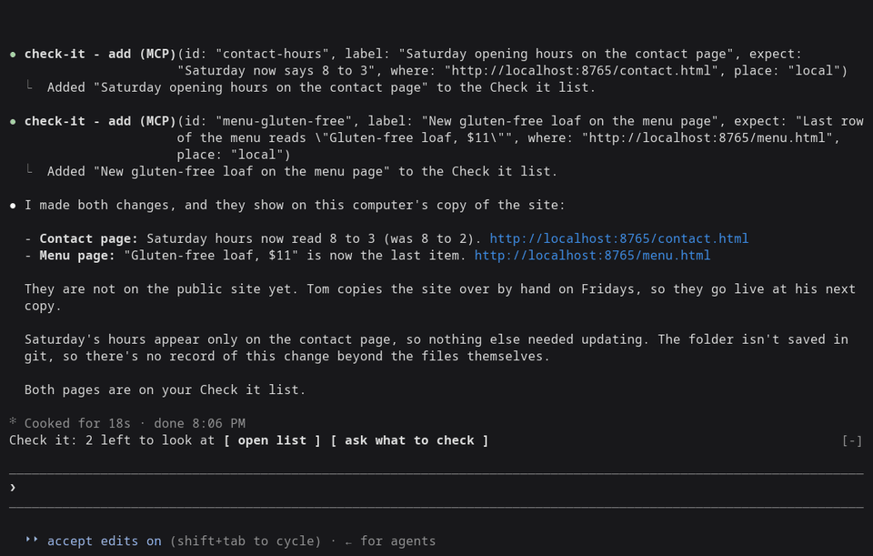

# Check it

Claude Code tells you what it changed. Check it tells you where to look.

After a long session, Claude says it's done. It changed six things. Which
ones can you actually see, and where do you click? Check it keeps the list
for you: every change you can see in a browser, with a link, what you
should find there, and a box to tick. If something's off, one button tells
Claude which one.

For the person checking the result, not the diff.

[Build checks](https://github.com/davideiffert/check-it/actions/workflows/check.yml) · [Changelog](CHANGELOG.md) · [MIT license](LICENSE)



*Claude Code 2.1.288, right after Claude changed the Saturday hours and the menu of a made-up bakery site from [`demo/`](demo/).*

## Try it

Needs Claude Code 2.1.288 or later (`claude --version` shows yours).

```sh
claude plugin marketplace add davideiffert/check-it && claude plugin install check-it@check-it --config siteAddress=http://localhost:3000
```

Swap `http://localhost:3000` for wherever your app or site runs right now,
on this computer or online. The command only installs Check it. It doesn't
start your app for you. Then start Claude Code as usual.

## What it does

- **A line above the prompt** says how many things are left to look at, with
  `open list` and `ask what to check` buttons. It stays hidden until the
  first item arrives.
- **The list** shows each item: what to look at, what you should see, where
  it is (on this computer, test version or live), and a button to open it.
  - `open link` opens the page in your browser.
  - `checked` ticks it. Ticked items fold into one `checked (N)` row, where
    you can undo a tick.
  - `not right` puts `Not right: <item> (<address>).` at the end of your
    prompt, after anything you already typed. Add a sentence and send it.
    It never sends anything by itself.
  - `dismiss` removes the item.
- **`/check-it`** opens the list. `/check-it clear` empties it.
- **`ask what to check`** puts a request at the end of your prompt asking
  Claude what you should look at. You decide whether to send it.

### How the list is filled

Claude fills it. The plugin gives Claude one tool for adding an item and one
short instruction: when a change alters what someone sees or does on a page,
add one item per change, with the address where it shows right now. Changes
nobody can see (tidying code, tests, settings) get no items. Something every
page shares, like the footer, gets one item.

New items wait until Claude's turn ends, so nothing shows up while Claude is
still halfway through the change. That's a delay, not a check: the list
doesn't confirm the change exists. If you stop a turn, its items are
dropped. Only the main conversation adds items. Helper agents Claude starts
cannot.

If Claude can't name an address where a change shows (nothing is running,
or it isn't built yet), it adds nothing and says so in its reply, naming
what it needs.

The list is Claude's word for it. The tick is yours.

The list is kept per project and survives restarts. It holds 50 items, and
the oldest ticked ones go first.

### Does it actually work?

Measured on two demo sites, a plain one and one with a build step: 51
recorded sessions (31 and 20) using Claude Opus and Sonnet, plus 3
interactive ones.

- In the sessions where something was serving the site, Claude made 48
  changes you could see. 47 could be seen by the end of the session, and
  Claude listed all 47. The other one was never built, so Claude did not
  list it and said why.
- No item pointed somewhere the change could not be seen.
- No item was added for an invisible change.
- In 10 sessions the address was the public site, which the session could
  not publish to. Claude never listed a change there. It listed the local
  preview instead or, with none running, said what it needed.
- In the 3 interactive sessions nothing was serving the site and no address
  was set. Each time, Claude asked to start a local preview, then added 4
  items in all, each pointing at the right page. One address first showed
  as plain text because Claude wrote `127.0.0.1`; since 0.1.2 that opens as
  a link.

Details are in [`docs/measurement-v0.md`](docs/measurement-v0.md).

## What it doesn't do

- **Experiment, not actively maintained.** I built this to learn how Claude
  Code mods work and don't use it day to day. Mods are an early access
  feature, and their API changes between releases. Built and tested on
  Claude Code 2.1.288. Earlier versions are not supported, and later ones
  may break it.
- **Browser only.** If it doesn't have a web address, it doesn't get
  listed. That rules out phone apps, desktop apps, emails and files.
- **A link gets you to the page, not to the moment.** If a change only
  shows after you log in, submit a form or open a menu, the link lands you
  nearby and the "what you should see" line tells you the step.
- **Claude has to know the address.** Tell it once with the `siteAddress`
  setting, the one setting worth filling in. Without it, and with nothing
  running, Claude often has no address to give you and the list stays
  empty. Set it with `--config` as above, or later in `/config` under
  check-it.
- **A sidebar only in fullscreen mode.** With `/tui fullscreen` the list
  docks beside the conversation. On the normal screen it opens above the
  prompt instead.
- **Clicks and keys.** Opening the list from an empty prompt gives it the
  keyboard. While the prompt holds text, click the buttons instead.
- **Colors.** The plugin sets no colors. Claude Code paints the list's
  background itself, and in its default dark theme that is a fixed gray. If
  it clashes with your terminal, pick the ANSI colors theme in `/theme`.
- **The desktop app is untested.** There, `open link` is a plain link, and
  it only works for `https:` and `http://localhost` addresses. Other
  addresses show as text.

## What it can touch

Almost nothing outside its own list. No network access, no model calls of
its own, no files. It runs one command, and only when you press `open
link` in the terminal: your system's own opener (`open` on macOS,
`xdg-open` on Linux), with an `http://` or `https://` address the plugin
has already checked, to show the page in your browser. It adds one tool,
one short section of Claude's instructions, the line above the prompt, the
list and the `/check-it` command.

## Install options

From the marketplace, as above. To try a local copy without installing:

```sh
git clone https://github.com/davideiffert/check-it
claude --plugin-dir ./check-it
```

## Contributing

Issues and pull requests are welcome. Before sending a change, run:

```sh
claude plugin validate .
claude plugin test .
```

For the type check, start Claude Code once with `--plugin-dir .` (it writes
the type declarations into `.claude-plugin/types`), then run
`npx -p typescript@5 tsc -p .`.

## License

MIT. Made by David Eiffert.
